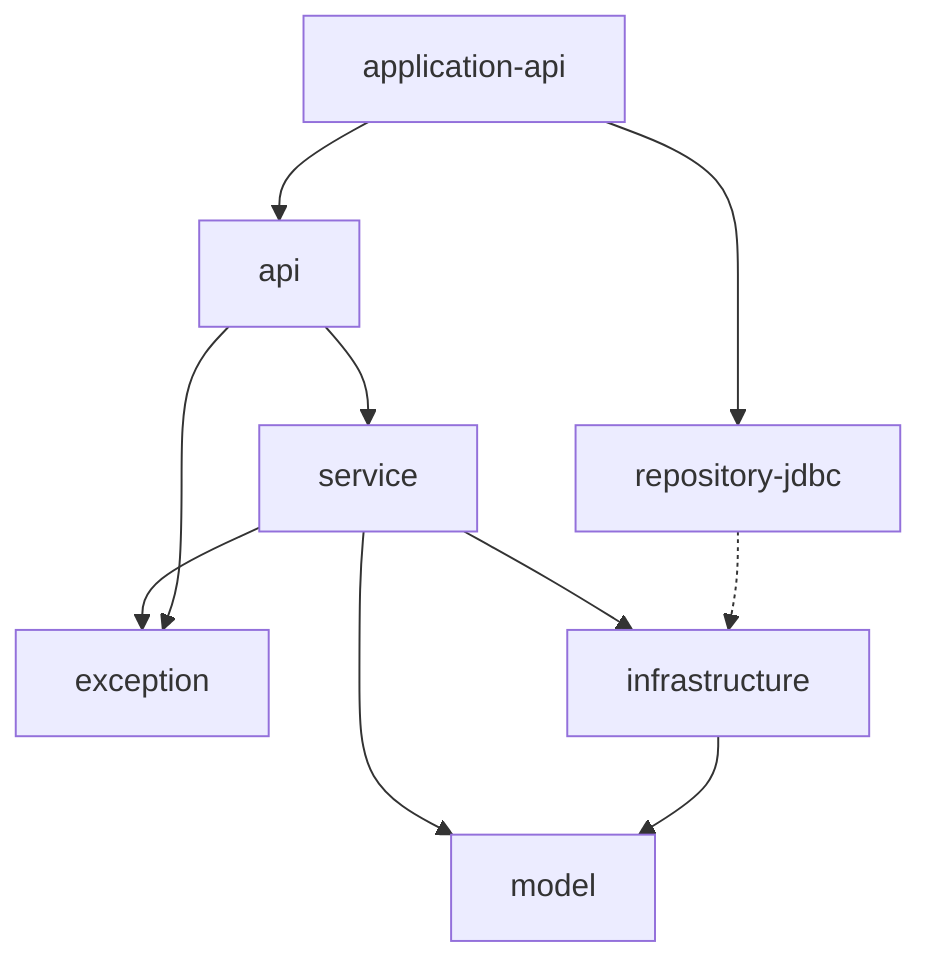

## 개요

Claude Code로 작업할 때 참고할 수 있는 Java Spring Boot 멀티모듈 프로젝트 구조입니다. **Hexagonal Architecture (Ports and Adapters Architecture)** 패턴을 기반으로 합니다.

## 아키텍처 원칙 (Claude Code 참고용)

### Hexagonal Architecture 레이어 구분
- **Domain Layer**: 순수 비즈니스 로직 - 외부 의존성 없음
- **Driving Side (Primary)**: HTTP 요청을 받는 컨트롤러 등
- **Driven Side (Secondary)**: 데이터베이스, 외부 API 호출 등

### Claude Code 작업 시 주의사항
- 각 모듈의 역할과 의존 방향을 항상 확인
- 새로운 기능 구현 시 적절한 모듈에 코드 배치
- 테스트 코드도 모듈별로 분리하여 작성

## 모듈 구조 (Claude Code 탐색 가이드)

```
project-root/
├── model/                  # 🎯 도메인 모델 - 비즈니스 객체 정의
├── exception/              # 🚨 예외 처리 - 도메인 특화 예외
├── service/                # 🔧 비즈니스 로직 - 핵심 기능 구현
├── infrastructure/         # 🔌 인터페이스 - 외부 시스템 연결 규약
├── repository-jdbc/        # 💾 데이터 접근 - DB 연동 구현체
├── api/                   # 🌐 API 계층 - 컨트롤러 및 DTO
├── application-{type}/     # 🚀 부트스트랩 - 애플리케이션 시작점
├── schema/                # 📊 DB 스키마 - 테이블 구조 정의
├── .claude/               # 🤖 Claude Code 설정
│   └── commands/          # 프로젝트별 slash commands
└── docs/                  # 📝 문서화
```


## 각 모듈 상세 (Claude Code 작업 가이드)

### Domain Layer (순수 비즈니스 로직)

#### model 모듈
- **목적**: 도메인의 핵심 비즈니스 모델 정의
- **포함 요소**:
  - 도메인 엔티티 (핵심 비즈니스 객체들)
  - 도메인 Identity 클래스들
  - 공통 속성 클래스들 (감사 정보 등)
- **의존성**: 순수 도메인 - 외부 의존성 없음
- **테스트**: 도메인 로직이 있는 경우 단위 테스트 필수

#### exception 모듈
- **목적**: 비즈니스 로직에서 발생하는 도메인 예외 정의
- **포함 요소**:
  - 도메인별 NotFound 예외들
  - 비즈니스 규칙 위반 예외들
  - 기타 도메인 특화 예외들

### Service Layer (비즈니스 로직 구현)

#### service 모듈
- **목적**: 비즈니스 로직 구현 및 유스케이스 정의
- **포함 요소**:
  - 도메인 서비스들 (조회, 생성, 수정, 삭제 등)
  - AutoConfiguration 클래스들
- **원칙**:
  - Persistence나 Network 모듈과 직접 참조 금지
  - Infrastructure 포트를 통한 간접 참조만 허용
- **테스트**: 비즈니스 로직 검증을 위한 테스트 필수

### Driving Side (외부 요청 처리)

#### api 모듈
- **목적**: REST API 엔드포인트 제공
- **포함 요소**:
  - Controller 클래스들
  - DTO 클래스들 (Request/Response 객체)
- **테스트**: Controller 수준의 request/response 검증 테스트

### Driven Side (외부 시스템 연동)

#### infrastructure 모듈
- **목적**: 외부 시스템과의 인터페이스 정의 (포트)
- **포함 요소**:
  - Repository 인터페이스들
- **원칙**: 구현체 포함하지 않음 (테스트 용이성을 위해)

#### repository-jdbc 모듈
- **목적**: JDBC를 통한 데이터 영속성 구현
- **포함 요소**:
  - JdbcRepository 구현체들
  - Entity 클래스들
  - AutoConfiguration 클래스들
- **테스트**: Integration Test를 통한 데이터베이스 동작 검증

### Bootstrap (애플리케이션 구성)

#### application-api 모듈
- **목적**: 애플리케이션 실행 및 설정
- **포함 요소**:
  - Main Application 클래스
  - 설정 클래스들 (Documentation, Security 등)
  - application.yml

#### schema 모듈
- **목적**: 데이터베이스 스키마 관리
- **포함 요소**:
  - Liquibase 변경 로그
  - 초기 스키마 및 데이터 스크립트

## 의존성 규칙



### 주요 원칙
1. **의존성 역전**: Service는 Infrastructure 구현체가 아닌 인터페이스에 의존
2. **단방향 의존**: 상위 레이어는 하위 레이어를 의존하지만 역방향은 불가
3. **순수 도메인**: Model과 Exception은 외부 의존성 없음
4. **멀티 쓰레딩 고려**: 멀티 쓰레딩 환경을 고려하여 코드 작성

## 기술 스택

- **언어**: Java 21
- **프레임워크**: Spring Boot 3.4.0(Spring Security 사용 금지)
- **빌드 도구**: Gradle 8.x
- **데이터베이스**: MySQL (운영), H2 (테스트)
- **테스트**: JUnit 5, TestContainers
- **문서화**: SpringDoc OpenAPI
- **컨테이너**: Docker, Docker Compose

## Docker 개발 환경 사용법

### 전체 서비스 실행 (Docker Compose)
```bash
# 애플리케이션 빌드
./gradlew application-api:bootJar

# 전체 서비스 (MySQL + 애플리케이션) 시작
docker-compose up -d

# 로그 확인
docker-compose logs -f

# 서비스 중지 및 정리
docker-compose down
docker-compose down -v  # 볼륨도 함께 삭제
```

### 개발자 모드 (MySQL만 Docker)
```bash
# MySQL만 Docker로 실행
docker-compose -f docker-compose.dev.yml up -d

# 애플리케이션은 로컬에서 실행 (local 프로필 사용)
./gradlew application-api:bootRun
```

### Docker 환경 설정
- **docker-compose.yml**: 전체 서비스 (MySQL + 애플리케이션)
- **docker-compose.dev.yml**: 개발용 (MySQL만)
- **Dockerfile**: Java 21 기반 애플리케이션 이미지
- **Spring Profiles**:
  - `local`: 로컬 MySQL 연결 (localhost:3306)
  - `docker`: Docker 컨테이너 간 연결 (mysql:3306)
  - `test`: H2 인메모리 데이터베이스

## 컨벤션

### 패키지 구조
```
{company}.{project}.{domain}.{layer}
```

### 명명 규칙
- **Service**: `{Domain}LookUpService`
- **Repository Interface**: `{Domain}Repository`
- **Repository Implementation**: `{Domain}JdbcRepository`
- **Entity**: `{Domain}Entity`
- **Configuration**: `{Domain}AutoConfiguration`

### 클래스 예시
```java
// Domain Model
public class DomainEntity {
    private final EntityIdentity identity;
    private final String name;
    // ...
}

// Service
public class EntityLookUpService {
    private final EntityRepository entityRepository;
    
    public EntityModel findEntity(EntityIdentity identity) {
        // 비즈니스 로직
    }
}

// Repository Interface (Infrastructure)
public interface EntityRepository {
    Optional<EntityModel> findByIdentity(EntityIdentity identity);
}

// Repository Implementation
public class EntityJdbcRepository implements EntityRepository {
    private final JdbcTemplate jdbcTemplate;
    
    @Override
    public Optional<EntityModel> findByIdentity(EntityIdentity identity) {
        // JDBC 구현
    }
}
```

### DTO
- Request, Response DTO는 record 타입을 활용합니다.